# 🎶 TSITP Wrapped

**TSITP Wrapped** is a full-stack Spotify analytics experience inspired by *The Summer I Turned Pretty*. It analyzes a user’s listening history and matches it against curated show playlists to determine their **character match**, **ship alignment**, **soundtrack overlap**, and overall **summer mood** — all rendered in a Wrapped-style UI.

---

## 💡 Why I Built This

I built TSITP Wrapped to explore how **TV shows and storytelling can shape our listening habits**.

After watching *The Summer I Turned Pretty*, I noticed how strongly the show’s soundtrack — and the emotions tied to its characters and relationships — influenced what I listened to outside the show itself. Songs associated with specific scenes, characters, or moods began showing up more frequently in my own playlists.

This project was a way to turn that observation into a product:
- Can we quantify how much a show’s music overlaps with a listener’s taste?
- Can audio features reveal alignment with different characters or relationships?
- How do emotional signals in music translate into a broader “vibe” or mood?

TSITP Wrapped blends **fan culture**, **data-driven personalization**, and **full-stack engineering** to examine how media consumption subtly reshapes our behavior — and how those patterns can be surfaced in a fun, reflective way.

---

## ✨ Features

- Match your music taste to **TSITP characters**
- Determine **Team Conrad vs Team Jeremiah**
- Compare listening patterns against show playlists
- Analyze **audio features** to compute similarity scores
- Visualize soundtrack & artist overlaps
- Generate a personalized **summer mood**
- Interactive, slide-based “Spotify Wrapped” experience

---

## 🧱 Tech Stack

### Frontend
- **React + Vite**
- **Tailwind CSS** (UI components)
- **Sonner** (toasts)
- Spotify OAuth (PKCE)

### Backend
- **Node.js + Express**
- **Prisma ORM**
- **Supabase (PostgreSQL)**

### External APIs
- **Spotify Web API**
- **ReccoBeats API** (audio feature enrichment)

---

## 🏗️ System Architecture

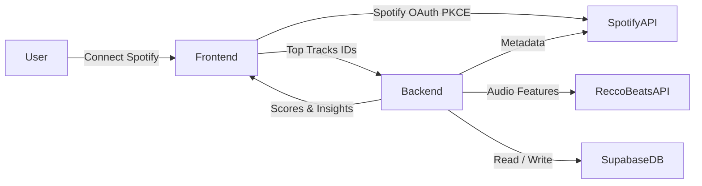
---
## 🧠 Backend Overview

### Routers

#### 🎧 Track

`GET /api/track/get-audio-features`
Fetches Spotify metadata + audio features from ReccoBeats for a track and upserts it into the database.

#### 📀 Playlist

`GET /api/playlist/get-tracks` 
Fetches all tracks from a Spotify playlist (paginated, filters out local/invalid tracks).

`GET /api/playlist/add-playlists-to-db` 
Upserts a playlist row by Spotify playlist ID.

`GET /api/playlist/link-playlist-to-db`
Fetches a Spotify playlist, retrieves audio features for each track, upserts tracks + features, and links them to the playlist.
#### 📊 Scoring

`POST /api/score/get-score`
Computes all matching, scoring, and analytics results for a user’s listening history.

### 🔌 External APIs We Call
#### Spotify Web API
- App-level auth
- User-level auth: fetch the current user’s top 50 tracks 
  - [GET me/top/{type}](https://developer.spotify.com/documentation/web-api/reference/get-users-top-artists-and-tracks)
- Track metadata (names, artists, IDs)
  - [GET tracks/{id}](https://developer.spotify.com/documentation/web-api/reference/get-track)
- Playlists 
  - [GET playlists/{playlistID}/tracks](https://developer.spotify.com/documentation/web-api/reference/get-playlists-tracks)

#### ReccoBeats API

Used to enrich tracks with audio features:
- danceability
- energy
- valence
- tempo
- acousticness
- instrumentalness
- loudness
- liveness
- speechiness
Retrived using this [GET /v1/track/:id/audio-features](https://reccobeats.com/docs/apis/get-track-audio-features)

### 📊 How Scoring Works

The scoring logic runs inside `/api/score/get-score`.

1. Sync & Feature Validation
- Ensure all provided Spotify track IDs exist in the database
- Fetch missing audio features and cache them

2. Centroid Construction
- Build averaged audio-feature vectors (“centroids”) for:
  - Each canonical TSITP playlist (characters, ships, soundtrack)
  - The user’s top tracks

3. Similarity Scoring
- Compute cosine similarity between the user centroid and each playlist centroid
- Highest similarity determines:
  - Best-match character
  - Winning ship (Team Conrad vs Team Jeremiah)

4. Overlap Analysis
- Count overlapping tracks from user's top 50 songs the past year with the show soundtrack
- Count overlapping artists from user's top 50 songs the past year with show artists

5. Mood Derivation
- Compare averaged audio features
- Map results to a qualitative summer mood
*(e.g., Golden Hour Sunny, Soft Nostalgia, Stormy Moody)*

#### Response Shape
```
{
  "characterMatch": {},
  "characterScores": {},
  "shipMatch": "Team Conrad",
  "shipScores": {},
  "soundtrackOverlap": {},
  "artistOverlap": {},
  "characterAudioFeatures": {},
  "summerMood": {
    "avgEnergy": 0.71,
    "avgDanceability": 0.64,
    "avgValence": 0.58
  }
}
```
---
## 🗄️ Database Design (Supabase + Prisma)

TSITP Wrapped uses **Supabase (PostgreSQL)** as the database, accessed through **Prisma ORM**.  
The schema is optimized for:
- storing canonical TSITP playlists + tracks
- enriching tracks with audio features
- supporting many-to-many playlist↔track relationships


### 📘 Database Terminology

- **PK (Primary Key)**  
  A primary key uniquely identifies each row in a table.  
  No two rows can share the same PK, and it cannot be null.

  **Example:**  
  `Track.id` uniquely identifies a single track in the `Track` table.

- **FK (Foreign Key)**  
  A foreign key is a column that references the primary key of another table.  
  It creates a relationship between tables and enforces referential integrity.

  **Example:**  
  `AudioFeatures.trackId` is a foreign key that references `Track.id`, meaning each audio-features row belongs to exactly one track.

### 📌 Entities

#### `Playlist`
Stores canonical TSITP playlists (characters, ships, soundtrack).

**Fields**
- `id` (PK)
- `name`
- `spotifyPlaylistId` (unique)
- `tracks` (relation via `PlaylistTrack`)

#### `Track`
Stores unique Spotify tracks (deduped across playlists).

**Fields**
- `id` (PK)
- `spotifyTrackId` (unique)
- `name`
- `artist[]` (array of artist names)
- `audioFeatures` (1:1 relation)
- `playlistEntries` (relation via `PlaylistTrack`)

#### `AudioFeatures`
One-to-one enrichment table for track-level audio features.

**Fields**
- `trackId` (PK + FK → `Track.id`)
- `danceability`
- `energy`
- `valence`
- `tempo`
- `acousticness`
- `instrumentalness`
- `loudness`
- `liveness`
- `speechiness`

#### `PlaylistTrack` (Join Table)
Join table to represent many-to-many relationships between playlists and tracks.

**Fields**
- `playlistId` (FK → `Playlist.id`)
- `trackId` (FK → `Track.id`)
- `position` (optional; preserves playlist ordering)
- Composite primary key: (`playlistId`, `trackId`)

### 🔗 Relationships (at a glance)

- `Playlist` **1 → many** `PlaylistTrack`
- `Track` **1 → many** `PlaylistTrack`
- `Track` **1 → 1** `AudioFeatures`


### 🧩 ER Diagram (Mermaid)

```mermaid
erDiagram
    PLAYLIST ||--o{ PLAYLIST_TRACK : contains
    TRACK ||--o{ PLAYLIST_TRACK : appears_in
    TRACK ||--|| AUDIO_FEATURES : has

    PLAYLIST {
      int id
      string name
      string spotifyPlaylistId
    }

    TRACK {
      int id
      string spotifyTrackId
      string name
      string[] artist
    }

    PLAYLIST_TRACK {
      int playlistId
      int trackId
      int position
    }

    AUDIO_FEATURES {
      int trackId
      float danceability
      float energy
      float valence
      float tempo
      float acousticness
      float instrumentalness
      float loudness
      float liveness
      float speechiness
    }

  ```
--- 
## 🎨 Frontend Overview

### Spotify Authentication Flow

1. User clicks “Connect Spotify”
2. Redirect to Spotify OAuth using PKCE
3. On callback:
  - Exchange auth code for tokens
  - Store tokens in localStorage
4. Fetch the user’s top 50 tracks (long_term)
5. Cache tracks in sessionStorage (tsitp_top_tracks)
6. Send track IDs to /api/score/get-score
7. Store scoring results in sessionStorage (tsitp_scores)

### 📱 Wrapped Experience (UI)
Slides Displayed

- Welcome
-   Intro to TSITP Wrapped
- Summer in Numbers
  - Soundtrack overlap (track-by-track with Spotify embeds)
  - Artist overlap badges
- Character Match
  - Best-match character
  - Match percentage
  - Playlist audio-feature averages
- Team Conrad vs Team Jeremiah
  - Progress bars for ship scores
  - Winning team highlight
- Summer Mood
  - Mood label derived from audio featuress
  - Visual vibe indicators

---

## 🚀 Running the Project
### Backend
```
cd backend
npm install
npm run dev
```

Environment variables required:
- Spotify app credentials
- Supabase DATABASE_URL
- Spotify playlist IDs for TSITP playlists

### Frontend 
```
cd frontend
npm install
npm run dev
```
Environment variables required:
- Spotify client ID
- OAuth redirect URI

## Results of TSITP Wrapped from different Spotify Users

*My Results*
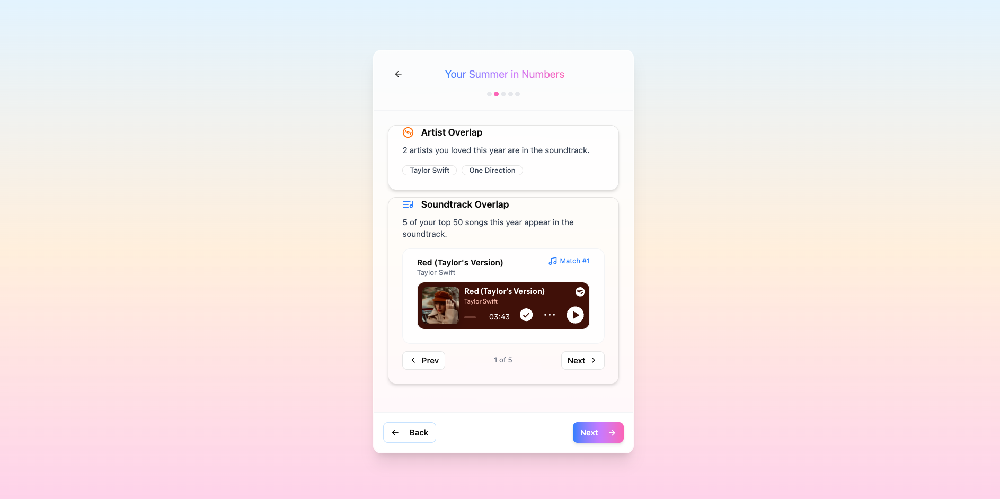
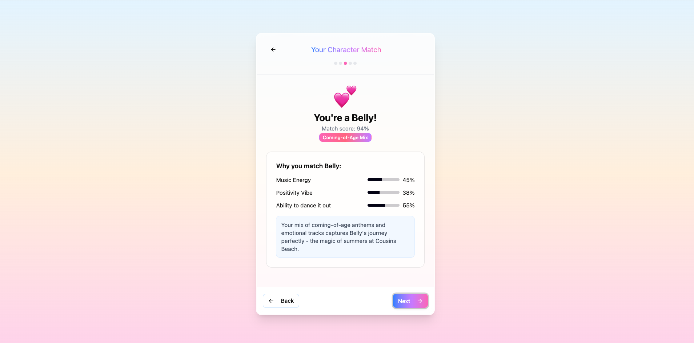
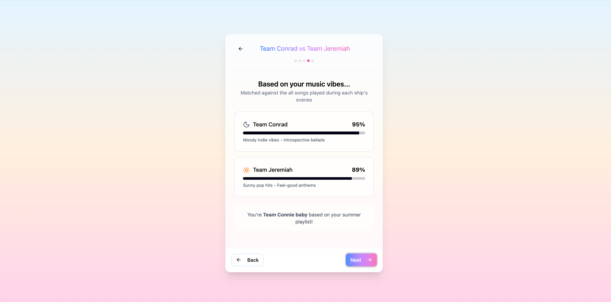
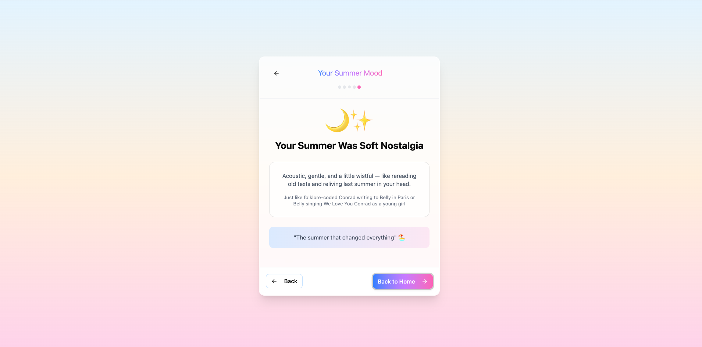


### Additional user captures are also available:

*User 2*
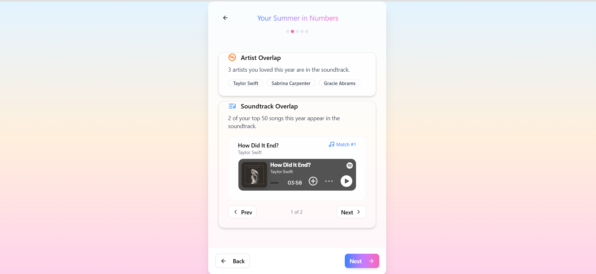
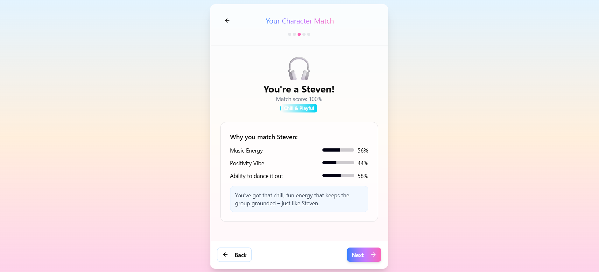
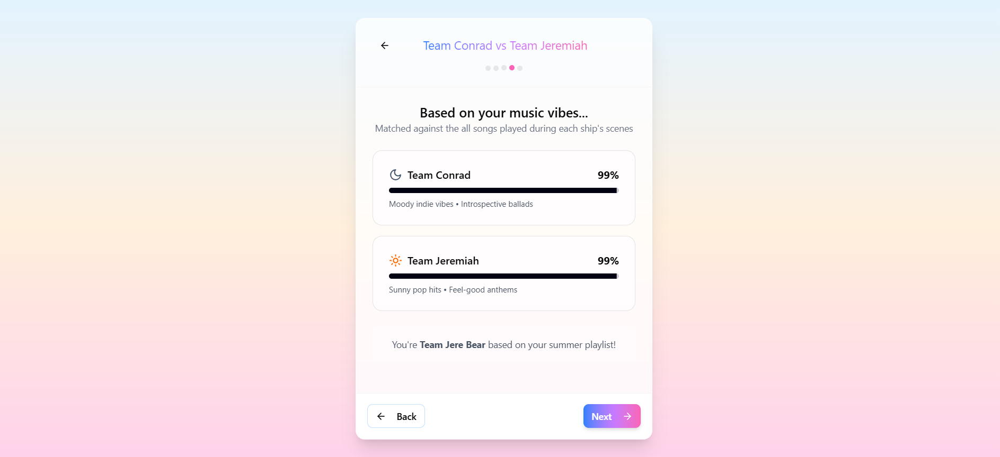
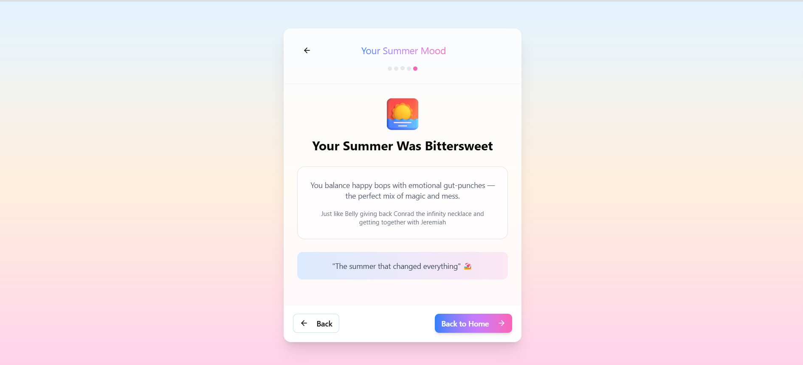

*User 3*
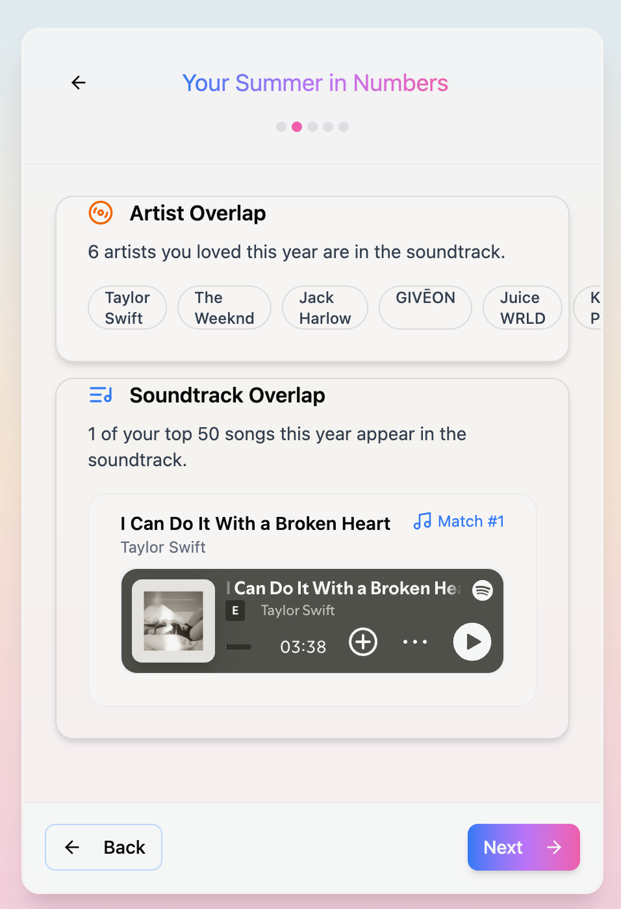
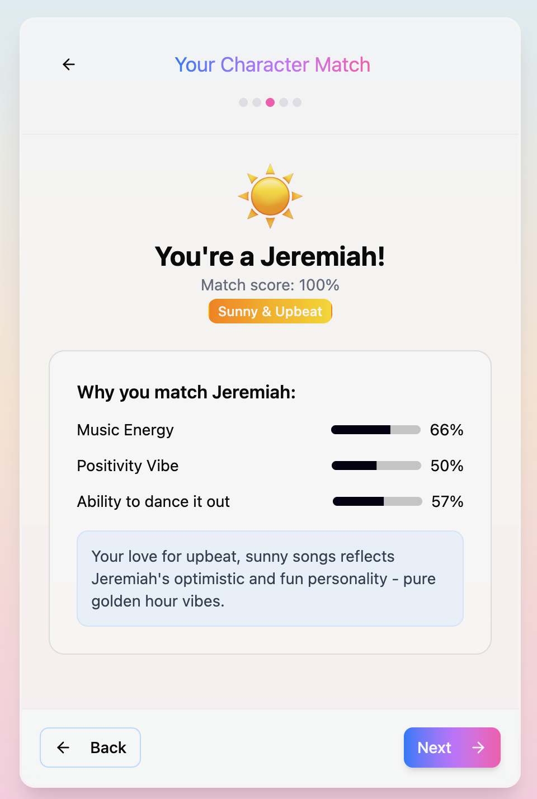
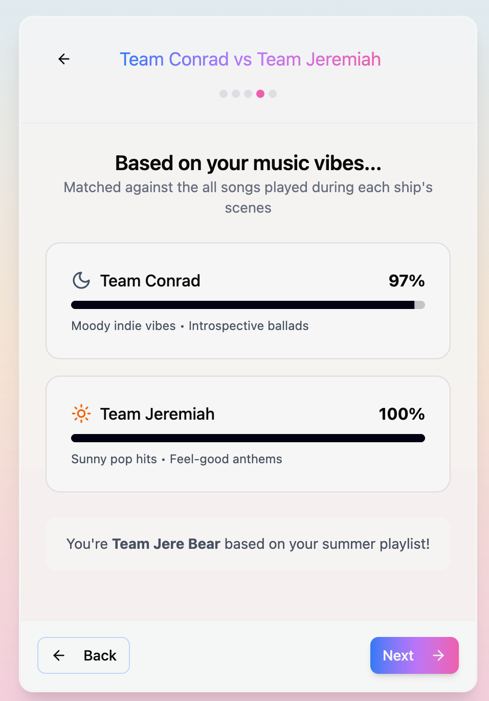
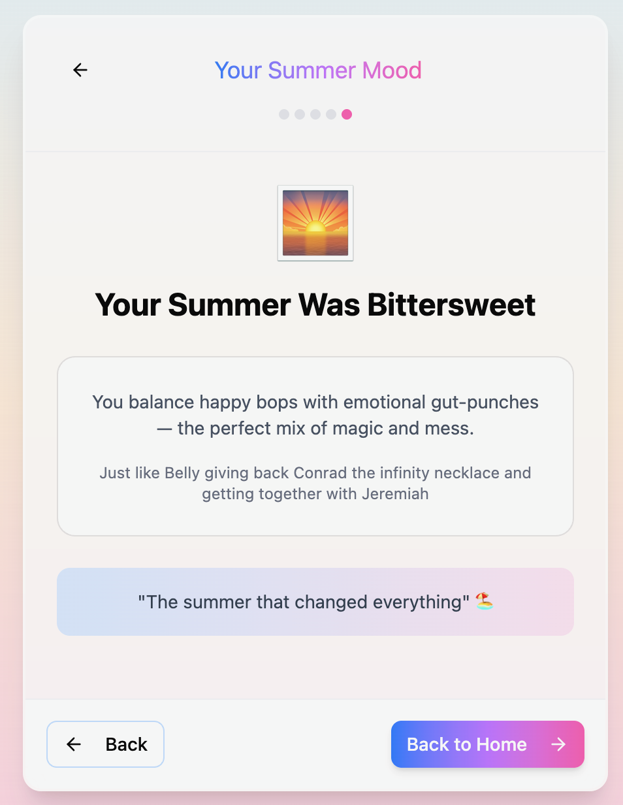
